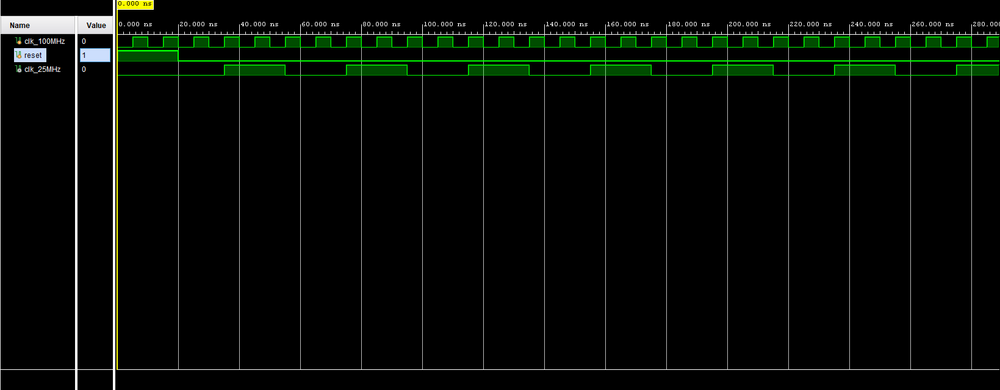

# FPGA Pong: VGA Display Controller

This repository contains the foundational VGA display controller for an FPGA-based Pong game, implemented in Verilog on the Digilent Nexys A7-100T development board. 

Currently, the system generates a 640x480 @ 60Hz resolution video signal, fully compliant with VESA timing standards, to render a solid white test screen. This serves as the blank canvas for the upcoming game logic.

## System Architecture

### RTL Hierarchy
* `pong_white_screen` (Top-Level)
  * `clk_gen_25MHz`: Divides the Nexys A7's 100 MHz onboard oscillator down to a 25 MHz pixel clock using a 2-bit counter.
  * `vga_sync`: Manages the horizontal and vertical synchronization pulses, front/back porches, and coordinates the 640x480 active visible area.

*Note: The porch offset values in `vga_sync.v` have been manually calibrated to center the image and compensate for modern LCD scaler delays.*

## Hardware Requirements
* **Board:** Digilent Nexys A7-100T
* **Output:** VGA Monitor
* **Inputs:** `SW0` (Pin J15) acts as the global system reset. Ensure this switch is flipped DOWN for the clock and display to run.

## Simulation & Verification
Behavioral simulations were conducted in Vivado prior to synthesis to verify timing accuracy. 

The image below demonstrates the testbench results for `clk_gen_25MHz.v`. The cursors verify a 40.000 ns period, confirming a clean 25 MHz pixel clock derived from the 100 MHz source.

