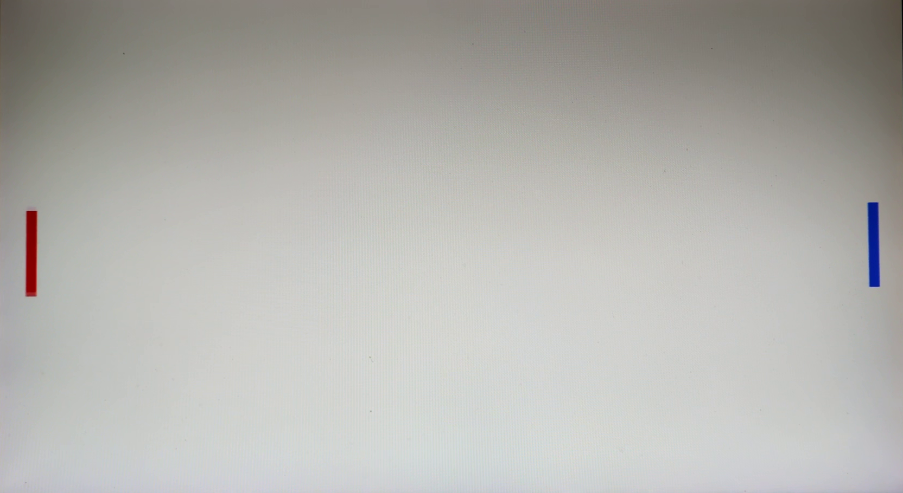

# FPGA Pong: VGA Paddle Controller

This repository contains the VGA display controller and paddle logic for an FPGA-based Pong game, implemented in Verilog on the Digilent Nexys A7-100T development board.

The system generates a 640x480 @ 60Hz VGA signal and renders two player-controlled paddles (red on the left, blue on the right) over a white background. Each paddle moves up/down once per frame in response to a pair of debounced pushbuttons.

## System Architecture

### RTL Hierarchy
* `pong_paddles` (Top-Level)
  * `clk_gen_25MHz`: Divides the Nexys A7's 100 MHz onboard oscillator down to a 25 MHz pixel clock using a 2-bit counter.
  * `sync_debouncer` (x4): FSM-based debouncer for each pushbutton — a two-FF synchronizer followed by a press/release timing FSM that rejects mechanical bounce.
  * `vga_sync`: Manages the horizontal and vertical synchronization pulses, front/back porches, the 640x480 active visible area, and renders both paddles.

*Note: The porch offset values in `vga_sync.v` have been manually calibrated to center the image and compensate for my specific monitor (Dell S2415H).*

The photo below confirms the calibrated porch timing centers the active video area on the physical monitor referenced above.

## Hardware & Software Requirements
* **Board:** Digilent Nexys A7-100T
* **Software:** Xilinx Vivado 2021.2
* **Output:** VGA Monitor
* **Inputs:**
  * `SW0` (Pin J15): global system reset. Flip DOWN for the clock and display to run.
  * `BTNU` / `BTNL` (`top_btn` / `left_btn`): move the left paddle up / down.
  * `BTNR` / `BTND` (`right_btn` / `bottom_btn`): move the right paddle up / down.

## Simulation & Verification
Behavioral simulations were conducted in Vivado prior to synthesis to verify timing accuracy.

The image below demonstrates the testbench results for `clk_gen_25MHz.v`. The cursors verify a 40.000 ns period, confirming a clean 25 MHz pixel clock derived from the 100 MHz source.

`sync_debouncer.v` synchronizes each raw button input and only accepts a press or release once it has held stable for `STABLE_COUNT` clocks, rejecting mechanical bounce.

The image below shows both paddles rendered on the VGA output, confirming `vga_sync.v` correctly draws the left (red) and right (blue) paddles over the white background.

